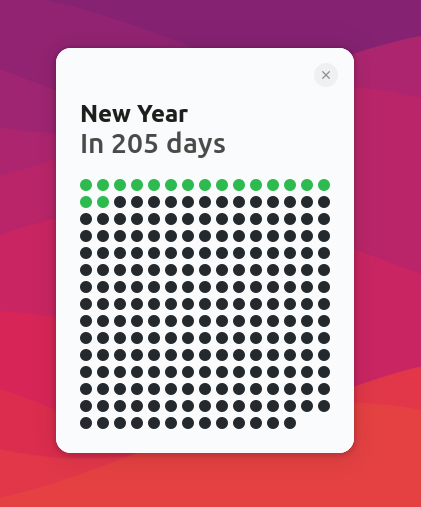
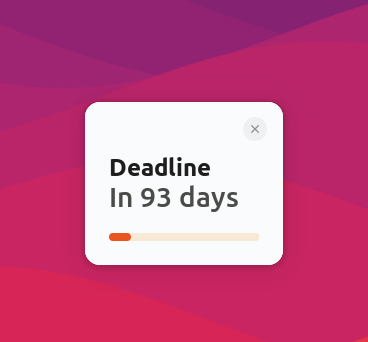

# Days Till Counter

Days Till Counter is a simple countdown application built in Rust using GTK4, designed to track the days until a specific date.




## Features

- Set a target date to count down to.
- Display the number of days remaining until the target date.
- Provides a progress bar indicating time left visually.
- Offers a clean and intuitive user interface.

## Prerequisites

Before you begin, ensure you have the following installed on your system:

1. **Rust**: Install Rust by following the instructions at [rust-lang.org](https://www.rust-lang.org/tools/install).
2. **GTK4**: Follow the steps provided in the [GTK4 installation guide](https://gtk-rs.org/gtk4-rs/stable/latest/book/installation.html).

## Installation Steps

### 1. Clone the Repository

Clone the Days Till Counter repository to your local machine:

```bash
git clone https://github.com/DagmawiSolomon/DaysTillCountdownTimer
cd daystill
```

### 2. Build the Application

Use Cargo, the Rust package manager, to build the application:

```bash
cargo build --release
```

### 3. Run the Application

After a successful build, you can run the application using Cargo:

```bash
cargo run
```

### 4. Finding the Compiled Binary

After building the application, the compiled binary file will be located in the `target/release` directory within your project folder. You can find the path to the compiled binary file by navigating to this directory:

```bash
cd target/release
```

The binary file will be named `daystill` (or `daystill.exe` on Windows). You can use the full path to this binary file in your system's task scheduler or crontab to automate running the program.

### Getting the Precompiled Binary

Alternatively, you can download the precompiled binary for Linux from the `daystill.zip` file:

- Download the precompiled binary [here](daystill.zip).
- Unzip the folder using the command `unzip daystill.zip -d daystill`.

This zip file contains the compiled binary `daystill` ready for use on Linux systems.

### Configuration

The application's settings can be customized via `assets/config.json`. For detailed information on configuration options, refer to the [Configuration Guide](CONFIGURATION.md).

### Linux: Setting up Automatic Startup

To ensure the application starts automatically on startup:

1. **Install GNOME Startup Applications**: If not installed, install it using:
   ```bash
   sudo apt install gnome-startup-applications
   ```

2. **Add the Application**:
   - Open "Startup Applications" from your system menu or execute `gnome-session-properties`.
   - Click "Add" and provide:
     - **Name**: Days Till Counter
     - **Command**: Enter the full path to the `daystill` binary (e.g., `/home/yourusername/path/to/daystill`).
     - **Comment**: Optional description.

   This configuration ensures the application launches every time you log in.

## Troubleshooting

If you encounter any issues:

- Verify all dependencies are correctly installed and configured.
- Check `Cargo.toml` for any missing dependencies or incorrect versions.
- Refer to the [GTK4-rs book](https://gtk-rs.org/gtk4-rs/stable/latest/book/) and [Rust documentation](https://doc.rust-lang.org/book/) for assistance.
- Feel free to create an issue on [GitHub](https://github.com/DagmawiSolomon/DaysTillCountdownTimer) for support and feedback.

## Contributing

Contributions are welcome! For suggestions, bug reports, or feature requests, please open an issue or submit a pull request on [GitHub](https://github.com/DagmawiSolomon/DaysTillCountdownTimer).

## License

This project is licensed under the [MIT License](LICENSE).

